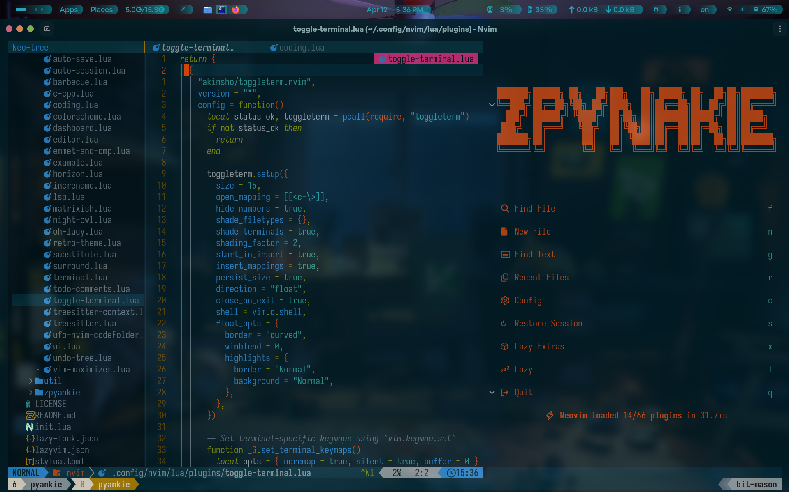

# ✨ My Neovim Config

A **fast**, **modern** Neovim setup built on [LazyVim](https://github.com/LazyVim/LazyVim), heavily inspired by [Takuya Matsuyama’s](https://github.com/craftzdog/dotfiles-public) elegant workflow, with my own tweaks and favorite plugins.

### 🔮 Highlights

- **Theme:** [solarized-osaka](https://github.com/craftzdog/solarized-osaka.nvim) _(with subtle customizations)_
    
- **Foundation:** LazyVim for performance + lazy-loading
    
- **Extra Plugins:** Handpicked for productivity and aesthetics
    

### 💝 Credits & Thanks

- [Takuya Matsuyama](https://github.com/craftzdog) for the inspiration (check out his [YouTube](https://youtu.be/fFHlfbKVi30?si=2H685KqVBxAYAFdk)!)
    
- The [LazyVim](https://github.com/LazyVim/LazyVim) team for an amazing starter config
    
- All the incredible plugin maintainers
    

---

## 🎨 Theme & Screenshot
**Solarized-osaka** with custom touches:  

  
   
  <em>Clean. Aint it?</em>

